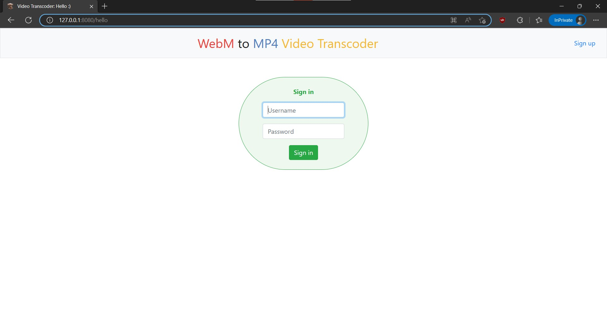
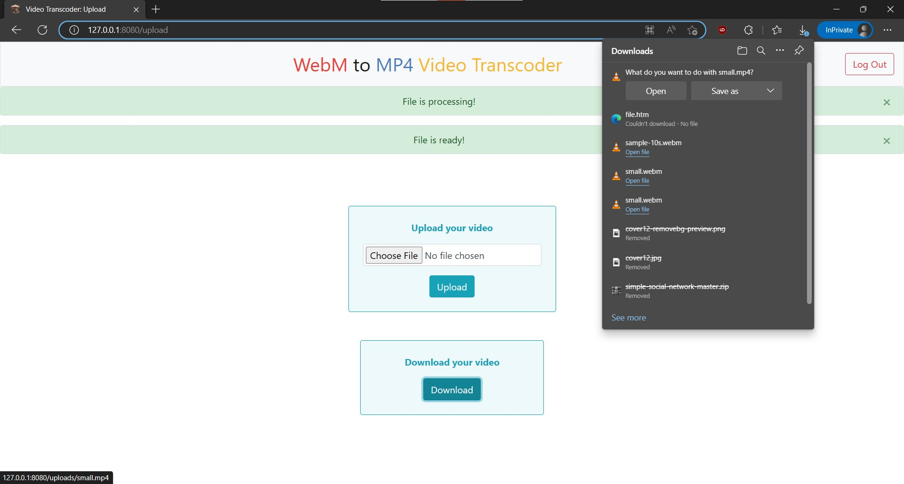

# ajax-video-transcoder

---

[](https://github.com/aimclub/OSA)

---

## Overview

ajax-video-transcoder is a secure web application that allows users to easily convert WebM videos to MP4. It provides a private and convenient way to transform video files, offering user authentication and a simple interface for uploading, processing, and downloading converted content.

---

## Table of Contents

- [Core features](#core-features)
- [Installation](#installation)
- [Getting Started](#getting-started)
- [Examples](#examples)
- [Contributing](#contributing)
- [Citation](#citation)

---
## Core features

1. **Video Transcoding**: Converts WebM video files to MP4 format using FFmpeg, providing a core functionality of the application.
2. **User Authentication**: Implements user registration and login with password hashing to secure access to the transcoding service.
3. **File Upload Handling**: Allows users to upload WebM files through a web interface, including file extension validation for security and correct format.
4. **File Download Functionality**: Enables users to download the converted MP4 video files via the web interface after successful transcoding.
5. **Secure File Processing**: Utilizes temporary file storage and secure filename handling during the upload and transcoding process to prevent vulnerabilities.
6. **Web Interface**: Provides a user-friendly web interface built with Flask for interacting with all application features, including uploading, monitoring, and downloading files.

---

## Installation

Install ajax-video-transcoder using one of the following methods:

**Build from source:**

1. Clone the ajax-video-transcoder repository:
```sh
git clone https://github.com/DRMPN/ajax-video-transcoder
```

2. Navigate to the project directory:
```sh
cd ajax-video-transcoder
```

3. Install the project dependencies:

```sh
pip install -r requirements.txt
```
## Getting Started

This web application provides a UI for converting .webm videos to .mp4. The README includes screenshots of the login form and file processing interface:





Currenty, no specific examples are provided in the `examples` directory detailing how to run or integrate this project beyond using the web UI.

---

## Examples

Examples of how this should work and how it should be used are available [here](https://github.com/DRMPN/ajax-video-transcoder/tree/master/examples).

---

## Contributing

- **[Report Issues](https://github.com/DRMPN/ajax-video-transcoder/issues)**: Submit bugs found or log feature requests for the project.

---

## Citation

If you use this software, please cite it as below.

### APA format:

    DRMPN (2023). ajax-video-transcoder repository [Computer software]. https://github.com/DRMPN/ajax-video-transcoder

### BibTeX format:

    @misc{ajax-video-transcoder,

        author = {DRMPN},

        title = {ajax-video-transcoder repository},

        year = {2023},

        publisher = {github.com},

        journal = {github.com repository},

        howpublished = {\url{https://github.com/DRMPN/ajax-video-transcoder.git}},

        url = {https://github.com/DRMPN/ajax-video-transcoder.git}

    }

---
